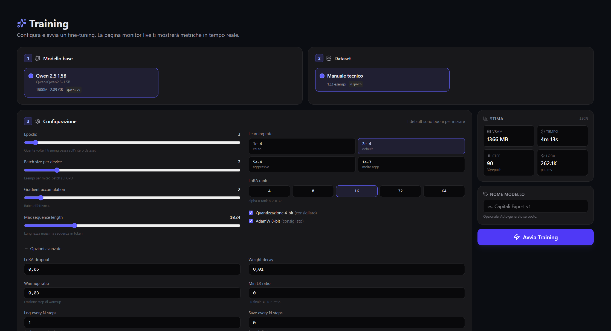
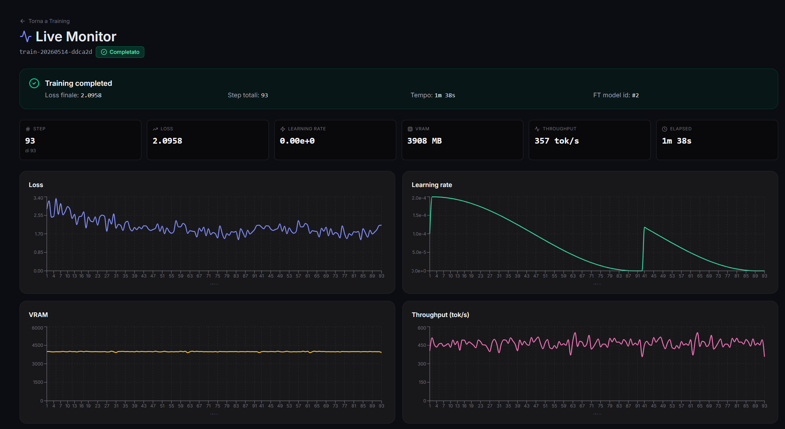
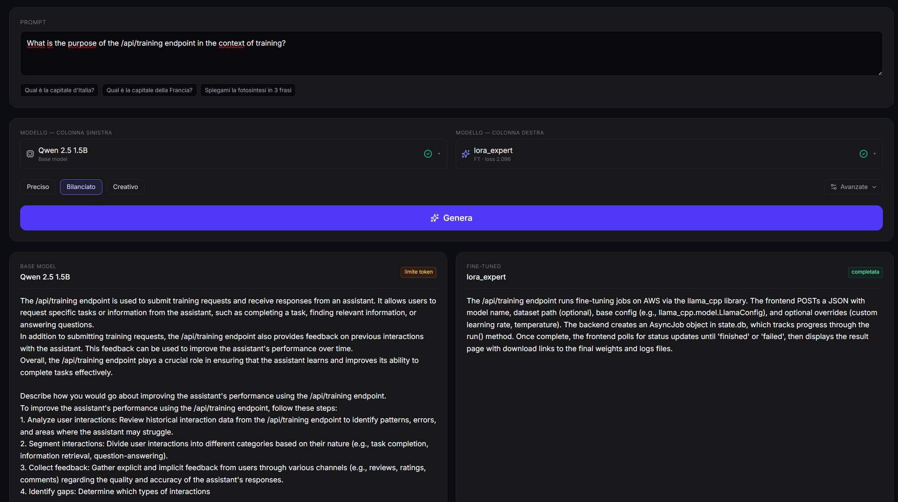
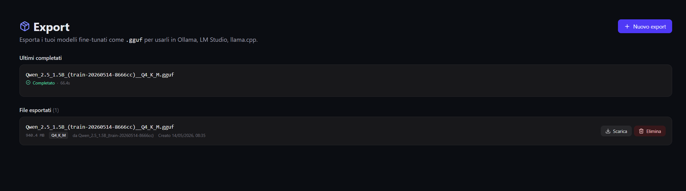

<div align="center">

# ⚡ NeuralForge

**Fine-tuning di LLM in locale, reso semplice.**

[](https://www.python.org/)
[](https://fastapi.tiangolo.com/)
[](https://react.dev/)
[](LICENSE)

Fine-tuna i large language models su GPU consumer con un'interfaccia web.
Training QLoRA, confronto inference side-by-side, export GGUF in un click — tutto in locale.

[🇬🇧 English](README.md) · **🇮🇹 Italiano**

</div>

---

## 📸 Anteprima

<p align="center">
  
</p>

### 🎥 Video demo

[](https://youtu.be/sem7k0spFh4)

Walkthrough end-to-end: download custom HuggingFace → import dataset → training QLoRA con monitor live → confronto base vs fine-tuned → export GGUF.

<details>
<summary><strong>Altri screenshot</strong></summary>

### Model Manager
Whitelist di modelli HuggingFace curati, download da repo HF custom con detection dei modelli gated, e un registro locale dei modelli scaricati.

<p align="center">
  
</p>

### Wizard Dataset
Wizard a 3 step per importare dataset da PDF, DOCX, CSV, TXT, JSON o JSONL in formato alpaca.

<p align="center">
  
</p>

### Configurazione Training
Config suggerita automaticamente in base alla GPU/VRAM rilevata, con controllo manuale completo sugli iperparametri QLoRA.

<p align="center">
  
</p>

### Live Monitor
Chart in tempo reale (loss, learning rate, VRAM, throughput) streammati via WebSocket durante il training.

<p align="center">
  
</p>

### Confronto Inference
Confronto side-by-side tra modello base e fine-tunato sullo stesso prompt.

<p align="center">
  
</p>

### Export GGUF
Conversione one-click a GGUF (Q4_K_M, Q5_K_M, Q8_0, Q3_K_M, F16). Scarica automaticamente llama.cpp al primo export.

<p align="center">
  
</p>

</details>

---

## Cos'è NeuralForge?

NeuralForge è una piattaforma di fine-tuning local-first per LLM. Avvolge lo stack PyTorch + PEFT + bitsandbytes con un'interfaccia web moderna, in modo che fare fine-tuning di un modello sui propri dati non richieda notebook, gymnastica da CLI o account cloud.

**L'intera pipeline gira sulla tua macchina.** Nessuna telemetria, nessuna API key, nessun dato che esce dall'hardware. Tu porti un base model da HuggingFace e un dataset; NeuralForge gestisce tokenizzazione, training QLoRA con monitoring live, confronto inference, ed export al formato GGUF usato da Ollama, LM Studio e llama.cpp.

Pensato per il sweet spot delle GPU consumer: una singola scheda da 12 GB (classe RTX 4070) è sufficiente per fare fine-tuning di modelli classe 1-3B.

## Validazione su caso reale

NeuralForge è stata usata per fare fine-tuning di un modello sulla sua stessa documentazione API come proof-of-concept. Il run completo è documentato nel video demo qui sopra.

| Voce | Valore |
|---|---|
| Hardware | NVIDIA RTX 4070 (12 GB VRAM) |
| Base model | Qwen2.5-1.5B-Instruct |
| Dataset | 123 coppie Q&A scritte a mano (NeuralForge API docs, senza AI generation) |
| Strategia | QLoRA, LoRA rank 32, 3 epoche |
| Tempo di training | **1 min 38 sec** |
| Step | 93 |
| Loss finale | 2.09 |
| VRAM di picco | ~3.9 GB |

### Output di esempio: base vs fine-tunato

Stesso prompt a entrambi i modelli: *"What is the purpose of the /api/training endpoint?"*

**Base model (Qwen2.5-1.5B-Instruct, senza fine-tuning):**

> The /api/training endpoint is used to submit training requests and receive responses from an assistant. It allows users to request specific tasks or information from the assistant, such as completing a task, finding relevant information, or answering questions.

→ Generico e off-topic. Il modello base non ha idea di cosa sia NeuralForge e tratta "training" come una specie di servizio di formazione aziendale.

**Modello fine-tunato (stesso base + 1m 38s di training QLoRA sul dataset):**

> The /api/training endpoint runs fine-tuning jobs (...). The frontend POSTs a JSON with model name, dataset path (optional), base config (e.g., LlamaConfig), and optional overrides (custom learning rate, temperature). The backend creates an AsyncJob object in state.db, which tracks progress through the run() method. Once complete, the frontend polls for status updates until 'finished' or 'failed', then displays the result page with download links to the final weights and logs files.

→ Stesso prompt, risposta completamente diversa: ora dentro al dominio NeuralForge. Il modello ha imparato la struttura request/response (POST + payload JSON), il pattern async job, e il flusso di polling. Ci sono alcune piccole imprecisioni (il backend reale non gira su AWS), ma lo shift di dominio è visibile e il pattern strutturale coincide con la documentazione.

Questo è un proof-of-concept su un dataset minimo. Con dataset più grandi (1000+ esempi), modelli più grandi (Phi-3.5-mini, Llama-3.2-3B) e più epoche, è ottenibile una specializzazione molto più netta — è la roadmap della v0.2.0.

## Funzionalità

- **Model Manager** — Whitelist di modelli HuggingFace curati + supporto a repo custom con detection dei modelli gated.
- **Dataset Engine** — Import da PDF, DOCX, CSV, TXT, JSON, JSONL. Chunking intelligente, deduplica, conversione in formato alpaca in un wizard a 3 step.
- **Training Engine** — Loop di training PyTorch custom con QLoRA (base a 4-bit), AdamW8bit, cosine warmup, gradient checkpointing. Cancel-safe.
- **Live Monitor** — Chart in tempo reale (loss, learning rate, VRAM, throughput) streammati via WebSocket durante il training.
- **Inference Playground** — Confronto side-by-side tra modello base e fine-tunato. Cache LRU con eviction a 2 slot. Preset di sampling (Preciso / Bilanciato / Creativo).
- **Export GGUF** — Conversione one-click a GGUF (Q4_K_M, Q5_K_M, Q8_0, Q3_K_M, F16). Scarica automaticamente llama.cpp al primo export. ~8s end-to-end per un modello da 135M.
- **System Awareness** — Auto-detection della GPU con configurazione di training suggerita in base alla VRAM disponibile.

## Stack

**Backend**
- Python 3.11+, FastAPI 0.115, SQLAlchemy 2.0, SQLite
- PyTorch 2.11 (CUDA 12.8), `transformers`, `peft`, `bitsandbytes`, `accelerate`
- llama.cpp (auto-installato dai release binaries) per l'export GGUF
- 408+ unit test che coprono ogni layer

**Frontend**
- React 19 + Vite + Tailwind 4
- `recharts` (chart training), `lucide-react` (icone), `react-router-dom`
- Consumer WebSocket per eventi training live

**Hardware target**
- GPU NVIDIA con CUDA 12.x, 8 GB+ di VRAM (consigliato 12 GB)
- Verificato su Windows 11; Linux supportato in linea di principio (non testato)

## Quick start

### Prerequisiti
- Python 3.11 o superiore
- Node.js 18+ e npm
- GPU NVIDIA con driver CUDA 12.x

### Setup

```powershell
git clone https://github.com/isilderrr1/NeuralForge.git
cd NeuralForge

# Backend
cd backend
python -m venv venv
.\venv\Scripts\activate
pip install -r requirements.txt
cd ..

# Frontend
cd frontend
npm install
cd ..
```

### Avvio

Apri due terminali.

**Terminale 1 (backend):**
```powershell
cd backend
.\venv\Scripts\activate
python -m uvicorn main:app --reload
```

**Terminale 2 (frontend):**
```powershell
cd frontend
npm run dev
```

Poi apri <http://127.0.0.1:5173> nel browser. Le API docs sono su <http://127.0.0.1:8000/docs>.

## Architettura

```
┌─────────────────────────────────────────────────────────────┐
│ Browser (React + Vite, porta 5173)                          │
│   ├─ Pagine: Dashboard, Dataset, Training, TrainingLive,    │
│   │          Inference, Monitor, Export, Models             │
│   └─ Componenti: ConfigSuggestion, GPUCard, QuickStartGuide │
└─────────────┬───────────────────────────────────────────────┘
              │ REST + WebSocket
┌─────────────▼───────────────────────────────────────────────┐
│ Backend FastAPI (uvicorn, porta 8000)                       │
│   ├─ /api/system   — detection GPU/CPU/RAM                  │
│   ├─ /api/models   — registry base model + download         │
│   ├─ /api/dataset  — ingestion multi-formato + alpaca conv. │
│   ├─ /api/training — start/cancel/list + eventi WS live     │
│   ├─ /api/inference— generazione side-by-side, cache modelli│
│   └─ /api/export   — pipeline GGUF                          │
└─────────────┬───────────────────────────────────────────────┘
              │
┌─────────────▼───────────────────────────────────────────────┐
│ Core (Python)                                               │
│   ├─ Training: loop QLoRA custom (PyTorch)                  │
│   ├─ Inference: model loader con cache (LRU, 2 slot)        │
│   ├─ Export: merge → convert → quantize (subproc llama.cpp) │
│   └─ Job: job manager async con cancel events               │
└─────────────┬───────────────────────────────────────────────┘
              │
       ┌──────┴──────┐
       │             │
   ┌───▼───┐   ┌─────▼──────┐
   │SQLite │   │ Filesystem │
   └───────┘   │  - models  │
               │  - datasets│
               │  - adapters│
               │  - exports │
               └────────────┘
```

## Roadmap

### v0.1.0 (attuale)
- ✅ M0: bootstrap full-stack
- ✅ M1: system detector + suggestion config training
- ✅ M2: model manager (download, gated detection, custom HF)
- ✅ M3: dataset engine (6 extractor, chunker intelligente, alpaca conv.)
- ✅ M4: training engine (QLoRA, AdamW8bit, cosine warmup)
- ✅ M5: training API + WebSocket live monitor + storico
- ✅ M6: inference + confronto side-by-side base/FT
- ✅ M7: pipeline export GGUF con llama.cpp auto-scaricato
- ✅ M8: polish, onboarding, documentazione, validazione real-world

### v0.2.0 (pianificato)
- Modulo Dataset Importer (MITRE ATT&CK, NIST CSF, CVE database, plugin custom)
- Base model più grandi (Gemma 4, Phi-3.5, Llama-3.2)
- Inference streaming via WebSocket (token-by-token)
- Confronto a 3 modelli
- Packaging desktop con Tauri (app nativa, installer MSI)
- i18n (Inglese + Italiano)

### Parking lot (un giorno)
- Pubblicazione Microsoft Store (con code signing)
- Modulo di adversarial testing (jailbreak detection, prompt injection probe)
- Dashboard di interpretability (attention head, layer activation)
- Modalità training con differential privacy

## Contribuire

Issue e PR benvenuti. Vedi [CONTRIBUTING.md](CONTRIBUTING.md) per le linee guida.

## Licenza

MIT — vedi [LICENSE](LICENSE).

---

<div align="center">

Costruito da **Antonio Ruocco**
Cybersecurity Engineer che impara AI engineering partendo dalle fondamenta.

[GitHub](https://github.com/isilderrr1) · [LinkedIn](https://www.linkedin.com/in/antonio-ruocco)

</div>
