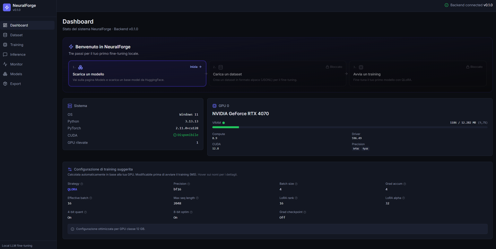
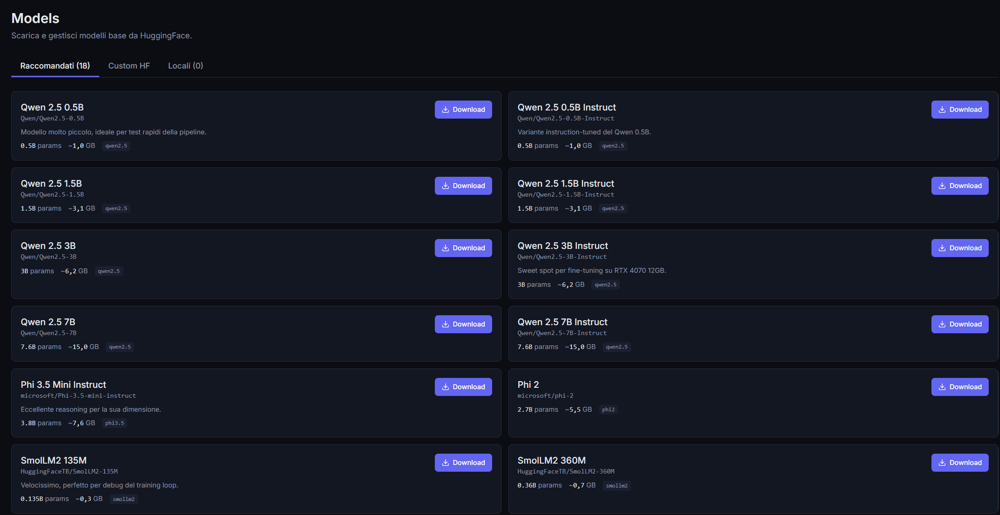
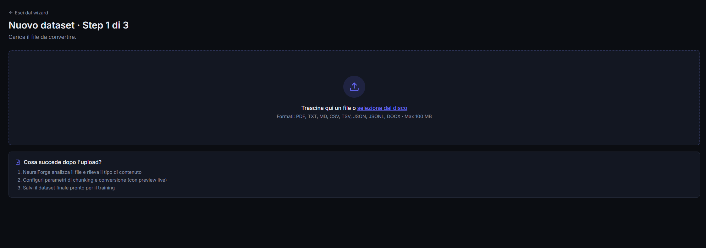

<div align="center">

# ⚡ NeuralForge

**Local LLM fine-tuning, made simple.**

[](https://www.python.org/)
[](https://fastapi.tiangolo.com/)
[](https://react.dev/)
[](LICENSE)

Fine-tune large language models on consumer GPUs with a web interface.
QLoRA training, side-by-side inference comparison, one-click GGUF export — all running locally.

**🇬🇧 English** · [🇮🇹 Italiano](README.it.md)

</div>

---

## 📸 Preview

<p align="center">
  
</p>

<details>
<summary><strong>More screenshots</strong></summary>

### Model Manager
<p align="center">
  
</p>

### Dataset wizard
<p align="center">
  
</p>

### Coming soon
- Training Live Monitor (real-time charts) — `docs/screenshots/training-live.png`
- Inference comparison (base vs fine-tuned) — `docs/screenshots/inference.png`
- GGUF Export — `docs/screenshots/export.png`

</details>

### 🎥 Demo video

<!-- TODO: Replace with real YouTube link once recorded -->
> A 2–3 minute walkthrough of the full workflow (download model → upload dataset → train → compare → export).
>
> **Coming soon:** `https://youtu.be/...`

---

## What is NeuralForge?

NeuralForge is a local-first fine-tuning platform for LLMs. It wraps the PyTorch + PEFT + bitsandbytes stack with a modern web UI so that fine-tuning a model on your data does not require notebooks, CLI gymnastics, or cloud accounts.

**The whole pipeline runs on your machine.** No telemetry, no API keys, no data leaving your hardware. You bring a base model from HuggingFace and a dataset; NeuralForge handles tokenization, QLoRA training with live monitoring, inference comparison, and export to the GGUF format used by Ollama, LM Studio, and llama.cpp.

Built for the consumer-GPU sweet spot: a single 12 GB card (RTX 4070-class) is enough to fine-tune 3B-class models.

## Features

- **Model Manager** — Whitelist of curated HuggingFace models + custom repo support with gated-model detection.
- **Dataset Engine** — Import PDF, DOCX, CSV, TXT, JSON, JSONL. Smart chunking, deduplication, alpaca-format conversion in a 3-step wizard.
- **Training Engine** — Custom PyTorch training loop with QLoRA (4-bit base), AdamW8bit, cosine warmup, gradient checkpointing. Cancel-safe.
- **Live Monitor** — Real-time charts (loss, learning rate, VRAM, throughput) streamed via WebSocket while training runs.
- **Inference Playground** — Side-by-side comparison of base vs fine-tuned models. LRU model cache with 2-slot eviction. Sampling presets (Precise / Balanced / Creative).
- **GGUF Export** — One-click conversion to GGUF (Q4_K_M, Q5_K_M, Q8_0, Q3_K_M, F16). Auto-downloads llama.cpp on first export. ~8s end-to-end for a 135M model.
- **System Awareness** — Auto-detects GPU and suggests a training configuration that fits the available VRAM.

## Stack

**Backend**
- Python 3.11+, FastAPI 0.115, SQLAlchemy 2.0, SQLite
- PyTorch 2.11 (CUDA 12.8), `transformers`, `peft`, `bitsandbytes`, `accelerate`
- llama.cpp (auto-installed via release binaries) for GGUF export
- 408+ unit tests covering every layer

**Frontend**
- React 19 + Vite + Tailwind 4
- `recharts` (training charts), `lucide-react` (icons), `react-router-dom`
- WebSocket consumer for live training events

**Hardware target**
- NVIDIA GPU with CUDA 12.x, 8 GB+ VRAM (12 GB recommended)
- Windows 11 verified; Linux supported in principle (untested)

## Quick start

### Prerequisites
- Python 3.11 or newer
- Node.js 18+ and npm
- NVIDIA GPU with CUDA 12.x drivers

### Setup

```powershell
git clone https://github.com/isilderrr1/NeuralForge.git
cd NeuralForge

# Backend
cd backend
python -m venv venv
.\venv\Scripts\activate
pip install -r requirements.txt
cd ..

# Frontend
cd frontend
npm install
cd ..
```

### Run

Open two terminals.

**Terminal 1 (backend):**
```powershell
cd backend
.\venv\Scripts\activate
python -m uvicorn main:app --reload
```

**Terminal 2 (frontend):**
```powershell
cd frontend
npm run dev
```

Then open <http://127.0.0.1:5173> in your browser. API docs are at <http://127.0.0.1:8000/docs>.

## Architecture

```
┌─────────────────────────────────────────────────────────────┐
│ Browser (React + Vite, port 5173)                           │
│   ├─ Pages: Dashboard, Dataset, Training, TrainingLive,     │
│   │         Inference, Monitor, Export, Models              │
│   └─ Components: ConfigSuggestion, GPUCard, QuickStartGuide │
└─────────────┬───────────────────────────────────────────────┘
              │ REST + WebSocket
┌─────────────▼───────────────────────────────────────────────┐
│ FastAPI backend (uvicorn, port 8000)                        │
│   ├─ /api/system   — GPU/CPU/RAM detection                  │
│   ├─ /api/models   — base model registry + downloads        │
│   ├─ /api/dataset  — multi-format ingestion + alpaca conv.  │
│   ├─ /api/training — start/cancel/list + live WS events     │
│   ├─ /api/inference— side-by-side generation, model cache   │
│   └─ /api/export   — GGUF pipeline                          │
└─────────────┬───────────────────────────────────────────────┘
              │
┌─────────────▼───────────────────────────────────────────────┐
│ Core (Python)                                               │
│   ├─ Training: custom QLoRA loop (PyTorch)                  │
│   ├─ Inference: cached model loader (LRU, 2 slots)          │
│   ├─ Export: merge → convert → quantize (llama.cpp subproc) │
│   └─ Jobs: async job manager with cancel events             │
└─────────────┬───────────────────────────────────────────────┘
              │
       ┌──────┴──────┐
       │             │
   ┌───▼───┐   ┌─────▼──────┐
   │SQLite │   │ Filesystem │
   └───────┘   │  - models  │
               │  - datasets│
               │  - adapters│
               │  - exports │
               └────────────┘
```

## Roadmap

### v0.1.0 (current)
- ✅ M0: full-stack bootstrap
- ✅ M1: system detector + training config suggestion
- ✅ M2: model manager (downloads, gated detection, custom HF)
- ✅ M3: dataset engine (6 extractors, smart chunker, alpaca conv.)
- ✅ M4: training engine (QLoRA, AdamW8bit, cosine warmup)
- ✅ M5: training API + WebSocket live monitor + history
- ✅ M6: inference + base/FT side-by-side comparison
- ✅ M7: GGUF export pipeline with auto-downloaded llama.cpp
- ✅ M8: polish, onboarding, documentation

### v0.2.0 (planned)
- Dataset Importer module (MITRE ATT&CK, NIST CSF, CVE database, custom plugins)
- Bigger base models (Gemma 4, Phi-3.5, Llama-3.2)
- Streaming WebSocket inference (token-by-token)
- 3-way model comparison
- Tauri desktop packaging (native app, MSI installer)
- i18n (English + Italian)

### Parking lot (someday)
- Microsoft Store submission (with code signing)
- Adversarial testing module (jailbreak detection, prompt injection probe)
- Interpretability dashboard (attention heads, layer activations)
- Differential privacy training mode

## Contributing

Issues and PRs welcome. See [CONTRIBUTING.md](CONTRIBUTING.md) for guidelines.

## License

MIT — see [LICENSE](LICENSE).

---

<div align="center">

Built by **Antonio Ruocco**
A Cybersecurity Engineer learning AI engineering from the ground up.

[GitHub](https://github.com/isilderrr1) · [LinkedIn](https://www.linkedin.com/in/antonio-ruocco)

</div>
